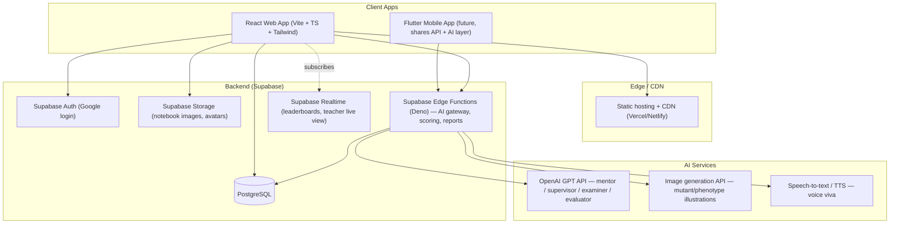

# 1. System Architecture

## 1.1 High-level architecture



## 1.2 Architectural principles

1. **Client-heavy simulation, server-light adjudication.** The genetics engine (crossing,
   selection, field events) runs entirely client-side for instant feedback — a plant breeding
   simulation must feel responsive, not round-trip to a server per generation. The server's job is
   persistence, scoring integrity, gamification bookkeeping, and anything that calls the AI.
2. **AI is a gateway, never a direct client call.** All GPT/image/speech calls go through Supabase
   Edge Functions so API keys never reach the client, requests can be rate-limited per student, and
   prompts can be centrally versioned (see `07-ai-workflow.md`).
3. **One canonical dataset.** Crop/germplasm/trait/gene/case content is authored once (as
   TypeScript data modules in the frontend today; migrated to DB-backed authoring via the Teacher/
   Admin dashboard in production) and synced into Postgres so both the client simulation and any
   server-side scoring/reporting use identical numbers.
4. **Offline-friendly core loop.** Zustand + `localStorage` persistence lets the breeding
   simulator, games, and notebook work with zero network latency and even offline; a sync layer
   reconciles to Postgres when connectivity is available (see `12-deployment.md`).
5. **Role-aware from day one.** Every table and screen distinguishes Student / Teacher / Admin,
   enforced at the database layer via Postgres Row Level Security, not just in the UI.

## 1.3 Component layers (frontend)

```
src/
  data/         # Domain data: crops, germplasm, traits, genes, breeding methods, field events,
                # detective cases, viva questions, missions, gamification config
  lib/          # Pure logic: genetics simulation engine (crossing, selection, scoring)
  store/        # Zustand stores: game progress (XP/badges/programs), field notebook
  components/   # Shared UI: layout shell, buttons, cards, trait bars
  modules/      # One folder per learning module (breeder, genelab, detective, supervisor,
                # viva, games, researchlab, notebook, career)
  pages/        # Top-level routed pages (Home dashboard)
```

## 1.4 Backend services

| Service | Responsibility |
|---|---|
| Supabase Auth | Google OAuth login, session/JWT issuance, role claims |
| PostgreSQL | System of record: profiles, courses, breeding programs, experiments, XP, badges |
| Supabase Storage | Field notebook images, avatars, generated mutant illustrations |
| Edge Functions | AI gateway (mentor/supervisor/examiner/evaluator prompts), server-side scoring
  validation, PDF/report generation, mission/XP reconciliation |
| Realtime | Live leaderboards, teacher "watch a class breed" dashboard |

## 1.5 Dashboards

Three dashboards share the same codebase with role-gated routes and Postgres RLS:

- **Student Dashboard** — the 9 modules, XP/level, career rank, notebook, missions.
- **Teacher Dashboard** — course creation, mission assignment, class progress, report generation,
  exam authoring, performance comparison across students.
- **Admin Dashboard** — institution management, crop/content authoring, usage analytics, cost
  monitoring for AI API usage.

## 1.6 Multi-tenancy

Each institution is a `courses.teacher_id`-scoped tenant; students join via a course join code.
Content (crops, genes, cases) is global/shared; progress and submissions are tenant-scoped through
`course_enrollments` and RLS policies (see `database/migrations/0002_rls_policies.sql`).
