# 2. Database Schema

Full SQL lives in `database/migrations/`:

- `0001_init.sql` — all tables
- `0002_rls_policies.sql` — Postgres Row Level Security policies
- `0003_seed_reference_data.sql` — seed data for breeding methods, field events, badges, missions

## 2.1 Entity-relationship overview

```mermaid
erDiagram
    profiles ||--o{ courses : teaches
    profiles ||--o{ course_enrollments : enrolls
    courses ||--o{ course_enrollments : has
    courses ||--o{ assignments : contains
    courses ||--o{ exams : contains

    crops ||--o{ traits : defines
    crops ||--o{ germplasm : has
    crops ||--o{ environments : has
    crops ||--o{ genes : has

    profiles ||--o{ breeding_programs : runs
    breeding_programs ||--o{ program_generations : advances
    program_generations ||--o{ program_individuals : contains
    germplasm ||--o{ breeding_programs : "used as parent"
    breeding_method_types ||--o{ breeding_programs : uses
    field_event_types ||--o{ program_generations : triggers

    profiles ||--o{ gene_edit_experiments : performs
    genes ||--o{ gene_edit_experiments : "edited in"

    detective_cases ||--o{ detective_attempts : attempted_by
    profiles ||--o{ detective_attempts : makes

    profiles ||--o{ supervisor_sessions : holds
    supervisor_sessions ||--o{ supervisor_turns : contains

    profiles ||--o{ viva_sessions : takes
    viva_sessions ||--o{ viva_responses : contains

    profiles ||--o{ game_scores : earns
    profiles ||--o{ research_analyses : runs
    profiles ||--o{ notebook_entries : records

    profiles ||--o{ user_badges : unlocks
    badges ||--o{ user_badges : awarded_as
    profiles ||--o{ xp_events : accrues
    profiles ||--o{ user_missions : completes
    missions ||--o{ user_missions : fulfilled_by
    profiles ||--o{ publications : authors
    profiles ||--o{ grants : receives

    assignments ||--o{ assignment_submissions : receives
    profiles ||--o{ assignment_submissions : submits
```

## 2.2 Table groups

| Group | Tables |
|---|---|
| Identity & courses | `profiles`, `courses`, `course_enrollments` |
| Reference/content data | `crops`, `traits`, `germplasm`, `environments`, `genes`, `field_event_types`, `breeding_method_types` |
| Module 1 — Breeder Simulator | `breeding_programs`, `program_generations`, `program_individuals` |
| Module 2 — Gene Function Lab | `gene_edit_experiments` |
| Module 3 — Gene Detective | `detective_cases`, `detective_attempts` |
| Module 4/5 — Supervisor & Viva | `supervisor_sessions`, `supervisor_turns`, `viva_sessions`, `viva_responses` |
| Module 6 — Games | `game_scores` |
| Module 7 — Research Lab | `research_analyses` |
| Module 8 — Field Notebook | `notebook_entries` |
| Module 9 — Career/Gamification | `badges`, `user_badges`, `xp_events`, `missions`, `user_missions`, `publications`, `grants` |
| Teacher tools | `assignments`, `assignment_submissions`, `exams` |

## 2.3 Design notes

- **JSONB for flexible, evolving shapes.** `trait_values`, `genotype`, `expression`, and
  `edit_outcomes` are JSONB because trait/gene schemas legitimately vary crop-to-crop and grow over
  time; indexing specific keys (e.g. `trait_values->>'yield'`) can be added with GIN indexes if
  query patterns demand it.
- **Text primary keys for content tables** (`crops.id = 'wheat'`, `genes.id = 'gene-ft'`) so the
  frontend's TypeScript data module ids map 1:1 onto database ids with no translation layer.
- **`program_individuals` is a self-referencing tree** (`parent_a_individual_id`,
  `parent_b_individual_id`) so a full pedigree can be reconstructed for any released variety —
  directly supporting the "detailed lineage tracking" requirement of pedigree breeding.
- **RLS enforces the owner pattern everywhere.** Every per-student table policy reduces to
  `student_id = auth.uid()` (directly or via a parent-table join), so a compromised client token
  can never read or write another student's data — see `0002_rls_policies.sql`.
- **`user_missions` uses a composite primary key including `completed_at`** so daily missions can
  be completed again on a subsequent day without a uniqueness conflict.
