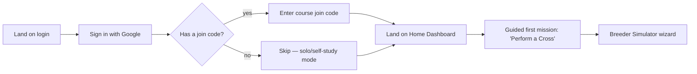
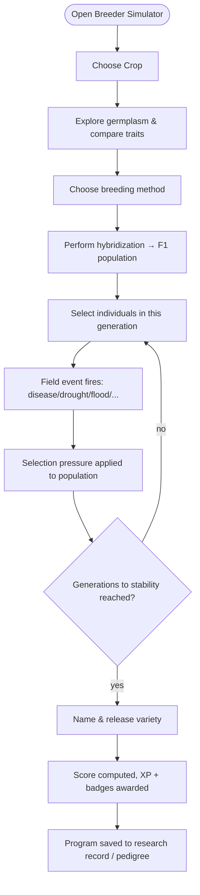
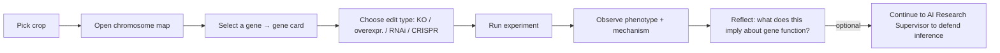
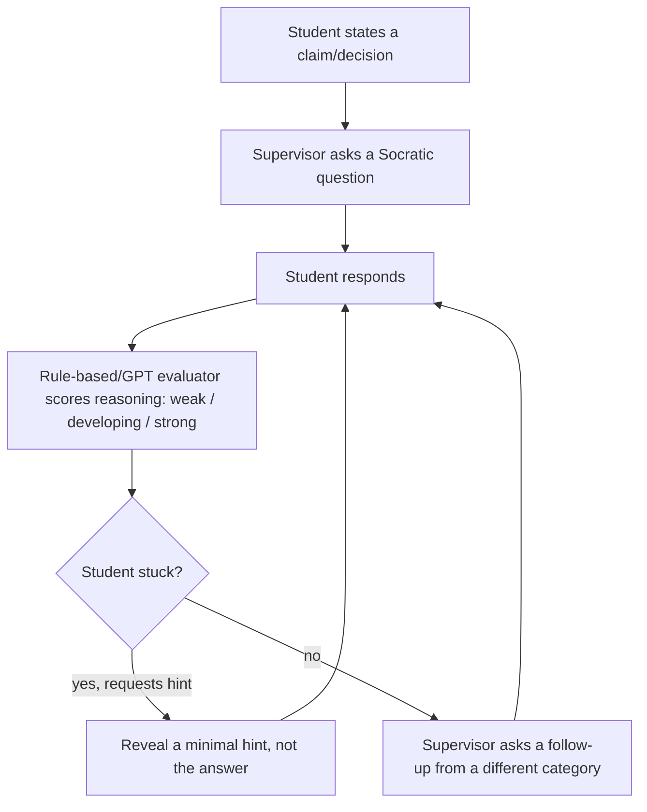
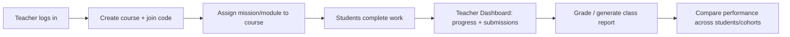

# 4. User Flows

## 4.1 First-time student onboarding

## 4.2 Core breeding program flow (Module 1)

## 4.3 Gene Function Discovery flow (Module 2)

## 4.4 AI Research Supervisor flow (Module 4)

## 4.5 Teacher flow

## 4.6 End-to-end "week in the life" of a student

1. Open app → daily missions surface on Home ("Perform a cross", "Answer 3 viva questions").
2. Spend 15 minutes in the Breeder Simulator advancing a wheat pedigree-breeding program.
3. A disease outbreak field event forces a selection decision; XP and a "Survivor" badge condition
   are tracked.
4. Switch to Gene Function Lab to knock out `Rht-B1` and observe the semi-dwarf phenotype.
5. Open the AI Research Supervisor to defend why they chose that parent — supervisor pushes back
   with "what evidence supports this?" until the reasoning is solid.
6. End the session in Career Mode, claiming completed missions and checking badge progress.
7. Weekly: finish the breeding program to release a variety, unlocking a publication and pushing
   the student from Student → Intern once enough XP accrues.
