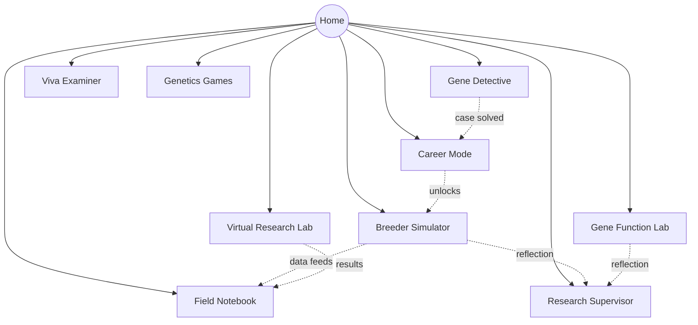

# 5. Navigation Map

## 5.1 Route tree (implemented)

```
/                     Home dashboard (module grid, XP summary)
/breeder              Module 1: AI Plant Breeder Simulator
  ?step=crop|parents|method|generations|release   (in-component wizard state)
/gene-lab             Module 2: Gene Function Discovery Lab
/detective            Module 3: AI Gene Detective (case list → active case)
/supervisor           Module 4: AI Research Supervisor (Socratic dialogue)
/viva                 Module 5: AI Viva Examiner
/games                Module 6: Genetics Games hub
  → Trait Prediction, Gene Matching (in-hub view switch)
/research-lab         Module 7: Virtual Research Lab
  → Heritability & Genetic Advance, ANOVA (in-hub view switch)
/notebook             Module 8: Field Notebook
/career               Module 9: Career Mode
```

## 5.2 Planned routes (production)

```
/login                                Google OAuth entry
/onboarding                           Role selection, join-course code
/teacher                              Teacher Dashboard root
/teacher/courses/:courseId            Course detail, roster, missions
/teacher/courses/:courseId/reports    Class performance reports
/teacher/exams/new                    Exam authoring (viva question bank picker)
/admin                                Admin Dashboard root
/admin/content/crops                  Crop/germplasm/gene content authoring
/admin/usage                          AI cost & usage analytics
```

## 5.3 Navigation diagram



Career Mode unlocking new crops/labs at higher levels (see `09-gamification.md`) is the one
cross-module gate; every other module is reachable at all times from the persistent sidebar so
instructors can assign modules in any order.

## 5.4 Information architecture principles

- **Sidebar is always present** — no dead-end screens; every module is one click from any other.
- **Module state lives in the module**, not the URL, for the wizard-style flows (breeder,
  detective case selection, games/analysis pickers) — keeps URLs simple while the app is
  single-session; deep-linkable sub-states (e.g. `/breeder/program/:id`) are a roadmap item once
  programs are server-persisted (see `13-roadmap.md`).
- **Teacher/Admin dashboards are role-gated at the router level** in production, backed by
  Postgres RLS so the restriction is not merely cosmetic.
