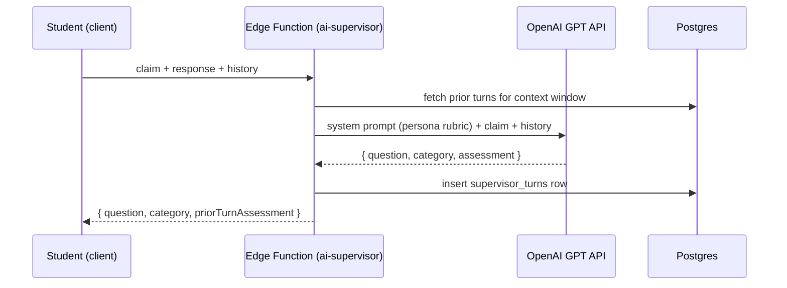

# 7. AI Workflow

## 7.1 The core design constraint

> The AI must never simply provide answers. It behaves as a mentor, research supervisor,
> examiner, breeding advisor, and scientific reviewer — never as a generic Q&A chatbot.

Every AI touchpoint is implemented as a **constrained persona with a rubric and a question bank**,
not an open-ended chat window. This is enforced in two layers:

1. **Prompt-level constraints** (production, GPT-backed): system prompts explicitly forbid
   revealing conclusions, require a Socratic question in every turn, and cap hints to one
   minimally-revealing sentence.
2. **Structural constraints** (already implemented in this codebase, rule-based): the Research
   Supervisor and Viva Examiner literally have no code path that emits a "here is the answer"
   message — `data/supervisorQuestions.ts` only contains question banks, and evaluation
   (`ResearchSupervisor.tsx`'s `evaluate()`) only ever grades reasoning quality, never supplies it.

This means the current build already demonstrates the pedagogical contract end-to-end without an
API key; swapping in GPT calls (per `06-api-structure.md`) upgrades the *quality and variety* of
questions without changing the contract.

## 7.2 AI personas and their prompts

| Persona | Module | Behavior contract |
|---|---|---|
| **Mentor** | Gene Function Lab reflection prompts | Poses a reflective question after every edit ("what does this imply about the gene's normal function?"); never states the function directly. |
| **Research Supervisor** | Module 4 | Only asks: justification / evidence / alternative-explanation / validation / next-step questions (`data/supervisorQuestions.ts`). Grades reasoning strength (weak/developing/strong) rather than correctness. |
| **Examiner** | Module 5 (Viva) | Adaptive multiple-choice questioning with branching follow-ups; difficulty rises on success streaks, falls on repeated misses. |
| **Breeding Advisor** | Module 1 field events | Surfaces the consequence of a field event and the trait it favors, but leaves the selection decision entirely to the student. |
| **Scientific Reviewer** | Module 3 (Detective) | Reveals clues progressively on request; evaluates a submitted hypothesis against the case's evidence-backed explanation, mirroring peer review. |
| **Lab Assistant** | Field Notebook / Research Lab | Offers interpretation scaffolding ("H² > 0.6 → direct selection should be effective") rather than doing the analysis for the student. |

## 7.3 Production GPT integration plan

System prompts are versioned files (`supabase/functions/ai-supervisor/prompts/v1.md`, etc.) so
prompt changes are code-reviewed and A/B-testable, not edited live.

## 7.4 Guardrails

- **No unearned answers.** Prompts explicitly instruct the model to refuse direct answers and
  redirect with a question, mirroring the rule-based fallback's structural guarantee.
- **Scientific accuracy grounding.** Detective-case and gene-editing evaluation prompts are given
  the case's `explanation` / gene's `edit_outcomes` as grounding context so the model grades
  against a fixed rubric instead of free-associating.
- **Graceful degradation.** If the AI call fails or a usage quota is hit, the client falls back to
  the static question banks already shipped (`data/supervisorQuestions.ts`,
  `data/vivaQuestions.ts`) — the learning experience never breaks, only loses adaptive variety.
- **No PII in prompts.** Only the student's claim/response text and anonymized session history are
  sent to the AI provider; profile data (name, institution) never leaves Postgres.

## 7.5 Multimodal AI features (roadmap-adjacent, see `13-roadmap.md`)

- **Image generation** for mutant phenotypes and gene-network diagrams, cached per (gene, edit
  type) so repeated students don't regenerate identical images.
- **Voice** for the Viva Examiner: speech-to-text for spoken answers, text-to-speech for the
  examiner reading questions aloud, supporting accessibility and hands-on-field-notebook use.
