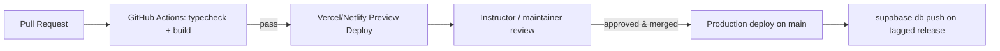

# 12. Deployment Strategy

## 12.1 Environments

| Environment | Frontend host | Backend | Purpose |
|---|---|---|---|
| Local dev | `npm run dev` (Vite, localhost:5173) | Local Supabase CLI (`supabase start`) or a shared dev project | Day-to-day development |
| Preview | Vercel/Netlify PR preview deploys | Shared Supabase "staging" project | Per-PR review, instructor UAT |
| Production | Vercel/Netlify production | Supabase production project | Live student/teacher usage |

## 12.2 Frontend deployment

1. `npm run build` in `frontend/` produces a static `dist/` (Vite). No server-side rendering is
   required — all data (crop/gene/case content) ships in the JS bundle for the MVP, and
   Supabase-backed data is fetched client-side post-login.
2. Deploy `dist/` to Vercel or Netlify; both provide automatic PR preview URLs, which is valuable
   for instructor sign-off on content changes (new crops, new detective cases) before merge.
3. Environment variables (`VITE_SUPABASE_URL`, `VITE_SUPABASE_ANON_KEY`) are injected at build
   time via the hosting provider's dashboard — never committed to the repo.

## 12.3 Backend deployment (Supabase)

1. Migrations in `database/migrations/*.sql` are applied via `supabase db push` (or the Supabase
   CLI's migration runner) in strict numeric order — `0001_init.sql` → `0002_rls_policies.sql` →
   `0003_seed_reference_data.sql` — so RLS is always enabled before any table is publicly reachable.
2. Edge Functions (`supabase/functions/*`, see `06-api-structure.md`) deploy via
   `supabase functions deploy <name>`; secrets (`OPENAI_API_KEY`, image/speech API keys) are set
   with `supabase secrets set` and never exposed to the client bundle.
3. A `sync-reference-data` Edge Function (admin-triggered) mirrors the canonical TypeScript content
   modules (`frontend/src/data/crops.ts`, `genes.ts`, etc.) into Postgres whenever course content is
   updated, keeping the client simulation and server-side scoring on identical data.

## 12.4 Offline-first sync strategy

The core loop (breeding simulator, games, notebook) works fully offline today via
`localStorage`-persisted Zustand stores. The production sync layer:

1. Continues writing to local state instantly (no perceived latency).
2. Queues a background write to the corresponding Supabase table.
3. On reconnect, replays the queue in order, using each row's client-generated UUID as an
   idempotency key so a retried write never double-inserts.
4. Server-recomputes anything score-bearing (`score-breeding-program`) so a client cannot inflate
   XP by tampering with local state before it syncs.

## 12.5 CI/CD

- Typecheck (`tsc -b`) and build (`vite build`) run on every PR; a failing build blocks merge.
- Database migrations are tagged and applied as an explicit, reviewed step separate from the
  frontend deploy, since schema changes are higher-risk than UI changes.

## 12.6 Monitoring & cost control

- Supabase's built-in dashboard covers DB size, request volume, and Auth activity.
- AI API spend is bounded via the per-student daily quota described in `06-api-structure.md §6.5`,
  surfaced on the Admin Dashboard's usage-analytics screen.
- Client errors are captured via a lightweight error-reporting hook (e.g. Sentry) once the AI
  Edge Functions are live, since that's where the most operationally interesting failures
  (rate limits, malformed AI responses) will occur.
